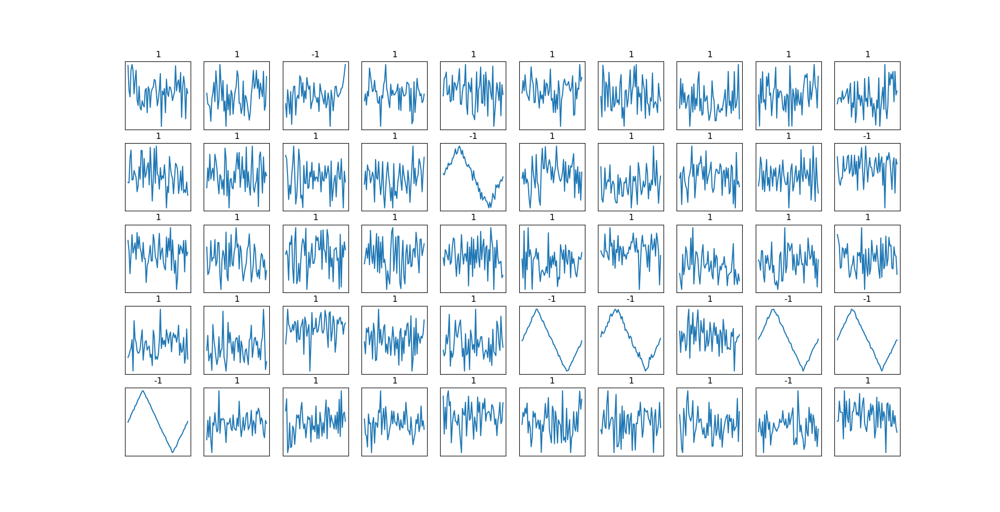

# AnormalDet
> 基于孤立森林（Isolation Forest）算法利用Python下sklearn框架实现的一维数集型数据的异常监测。    

---
## 数据集
> 由内嵌的generator.py模块自动生成原始数据集，其中正常数据为含有高斯白噪（SNR=50）的水平波，异常数据为含有高斯白噪（SNR=30）的三角波，每一段波形由50个有序一维点集构成，每个样本即为这50个一维点集。    

---
## 算法模型
> 孤立森林算法<sup>[1]</sup>是一种适用于连续数据的无监督异常检测方法，由南京大学周志华教授等人于2008年首次提出，之后又于2012年提出了改进版本<sup>[2]</sup>。与其他异常检测算法通过距离，密度等量化指标来刻画样本间的疏离程度不同，孤立森林算法通过对样本点的孤立来检测异常值。该算法利用一种名为孤立树的二叉搜索树结构来孤立样本，由于异常值的数量较少且与大部分样本的疏离性，因此异常值会被更早的孤立出来，也即异常值会距离根节点更近，而正常值则会距离根节点有更远。此外，相较于LOF，K-means等传统算法，孤立森林算法对高纬数据有较好的鲁棒性。<sup>[3]</sup>    
> 本项目主要利用了Python语言以及sklearn框架实现孤立森林算法<sup>[4]</sup>并基于生成的数据集对该算法进行了验证。如下为训练后的模型在测试集的表现，其中标签1代表预测为正常数据，标签-1代表预测为异常数据，对应图片为测试集点集。    
>     
> ```
> // 上图所示模型的训练相关参数
> SAMPLE_NUM = 1000         // 生成样本总数
> ANORMAL_FRACTION = 0.15   // 异常样本占比
> SECTION = 60              // 样本点集大小，同时也是样本特征维度
> TEST_SIZE = 0.3           // 测试集占比
> RANDOM_SEED = 42          // 随机种子
> ```
> 可以看出，虽然在一部分样本上模型产生了差错，但是总体上表现仍然可圈可点值得深入研究。

---
## 文件说明
> train.py -- 用于训练IForest模型    
> generator.py -- 用于生成样本数据    
> test.py -- 用于检验训练模型重载时的性能    
> iforest_det.pkl -- 已训练完成的模型参数文件，可通过重载直接使用

---
## 参考文献
> [1][Liu, Fei Tony, Kai Ming Ting, and Zhi-Hua Zhou. “Isolation forest.” Data Mining, 2008. ICDM’08. Eighth IEEE International Conference on. IEEE, 2008.](http://www.researchgate.net/publication/224384174_Isolation_Forest)    
> [2][Liu, Fei Tony, Kai Ming Ting, and Zhi-Hua Zhou. “Isolation-based anomaly detection.” ACM Transactions on Knowledge Discovery from Data (TKDD) 6.1 (2012): 3.](https://www.researchgate.net/publication/239761771_Isolation-Based_Anomaly_Detection)    
> [3][孤立森林（Isolation Forest）算法简介: https://www.jianshu.com/p/d9fb673301a3.](https://www.jianshu.com/p/d9fb673301a3)    
> [4][scikit-learn sklearn.ensemble.IsolationForest: https://scikit-learn.org/stable/modules/generated/sklearn.ensemble.IsolationForest.html](https://scikit-learn.org/stable/modules/generated/sklearn.ensemble.IsolationForest.html)    
